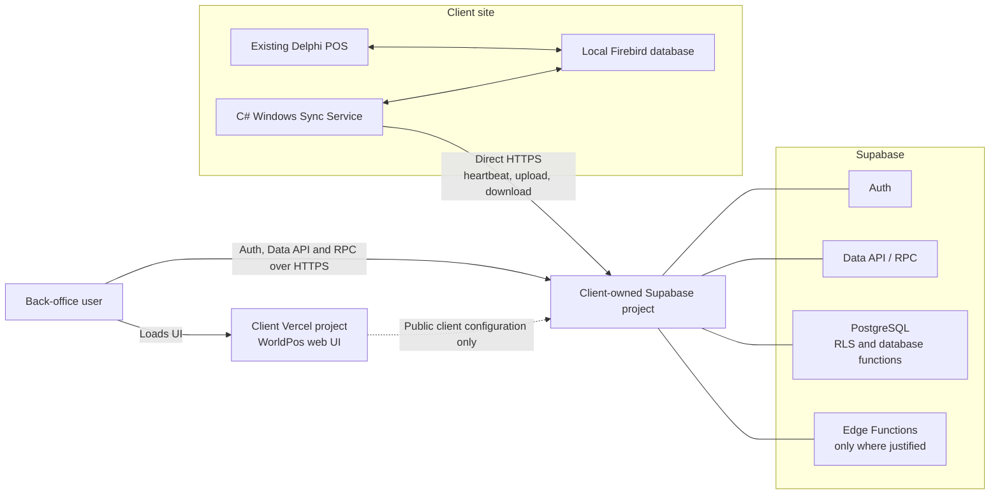
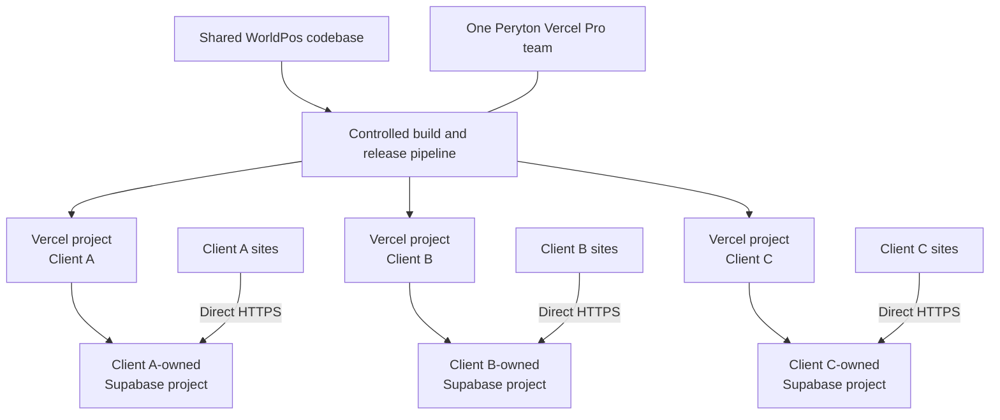
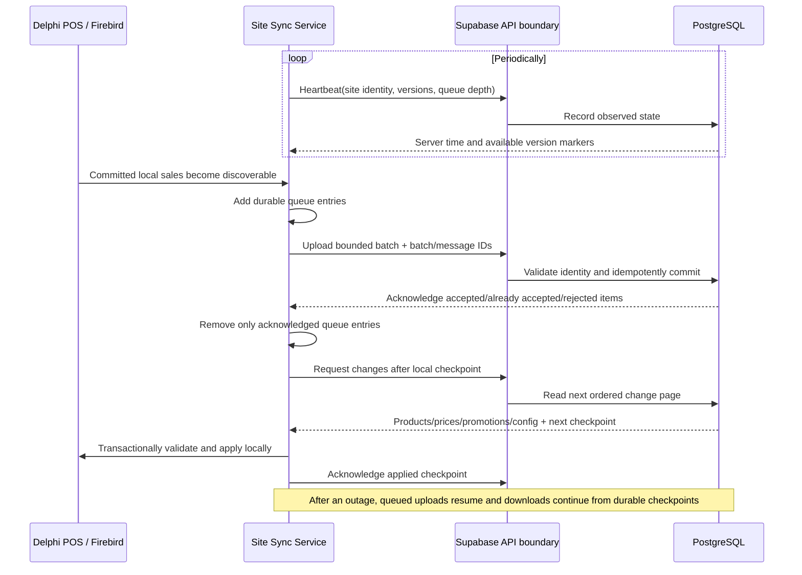
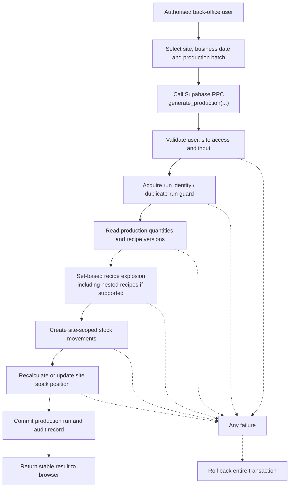

# WorldPos Cloud Architecture

**Status:** Authoritative architecture baseline  
**Intended audience:** WorldPos developers, reviewers, operators and Codex  
**Document owner:** Peryton  
**Last updated:** 10 August 2026

## 1. Purpose

This document defines the target architecture and mandatory development constraints for WorldPos Cloud. It is the authoritative reference for implementation plans, technical designs and code changes.

The system modernises the WorldPos back office without replacing the existing Delphi/Firebird point-of-sale system. It introduces a browser-based cloud back office, isolated cloud services for each client and a resilient site synchronisation service.

If an implementation decision conflicts with this document, the implementation must stop until the conflict is resolved and this document is updated through review.

## 2. Architectural goals

- Preserve uninterrupted local POS trading during internet or cloud outages.
- Isolate every WorldPos client at deployment, database, identity and operational boundaries.
- Keep Vercel usage predictable by using it primarily to serve the browser application.
- Send ordinary authorised browser data requests directly to the client's Supabase project.
- Send POS synchronisation traffic directly from each site to the client's Supabase project over HTTPS.
- Place data-intensive transactional business logic close to the data in PostgreSQL.
- Support gradual migration from the existing WorldPos environment.
- Maintain one shared application codebase without client-specific forks.
- Allow each client to scale and upgrade independently.
- Make synchronisation recoverable, observable, idempotent and safe to retry.
- Apply least privilege to both human and machine access.

## 3. High-level system overview

WorldPos Cloud consists of four principal parts:

1. A browser-based WorldPos back-office application served by Vercel.
2. A client-owned Supabase project containing the client's cloud data, identities, policies, APIs and server-side business logic.
3. The existing Delphi POS application and Firebird database at each site.
4. A C# Windows Sync Service at each site, connecting local Firebird data to Supabase over outbound HTTPS.

Vercel is not an application data proxy. Supabase is the primary cloud application and data platform. The local POS remains the operational system required to trade at a site.

## 4. Deployment topology

Peryton operates one Vercel Pro team. Within that team, each WorldPos client has a separate Vercel project and production deployment. Each deployment is configured to connect only to that client's separate, client-owned Supabase project.

Required topology rules:

- One client must not share a production Supabase project or PostgreSQL database with another client.
- Each Vercel project must contain only the public configuration for its matching Supabase project and any deployment-specific non-secret settings.
- Production domains, environment variables, logs, access and deployment permissions must be scoped per client where the platforms permit it.
- Client ownership of Supabase must be documented, including Peryton's administrative access, support rights, billing responsibility and offboarding process.
- Non-production environments must never use production data by default. Sanitised or synthetic data is preferred.

## 5. Strict client isolation

Client isolation is structural, not merely a `client_id` filter in application code.

- Each client has a separate Supabase project, database, Auth tenant, API endpoint, storage boundary, secrets and resource limits.
- Each client has a separate Vercel project/deployment and deployment configuration.
- No shared multi-tenant production database may be introduced.
- Cross-client reporting or administration, if later required, must use an explicitly designed integration that exports only authorised data. It must not weaken the primary isolation model.
- Peryton support access must be named, auditable, time-bounded where practical and protected by MFA.
- Data exports, backups, logs and local diagnostic files must preserve the same isolation.
- Tests must prove that a user or site identity cannot address another site or client by changing request identifiers.

Within a client's database, sites are isolated by authorisation rules. Users may have access to one, several or all of that client's sites according to assigned roles. Site services may access only their own site and explicitly published client-wide configuration.

## 6. Vercel responsibilities

Vercel is primarily responsible for:

- Serving the browser-based WorldPos back-office UI: HTML, JavaScript, CSS, fonts, images and other static assets.
- Hosting one client-specific application deployment per client.
- Managing application domains, TLS and controlled UI releases.
- Supplying public runtime configuration needed for the browser to connect to the matching Supabase project.

Ordinary business-data operations should follow this path wherever Supabase Auth, RLS and RPC can make it safe:

`Browser -> client's Supabase Data API/RPC -> PostgreSQL`

Avoid Next.js server-side rendering, Server Actions, API routes, middleware or Vercel Functions for routine products, prices, sales, reports, stock and configuration traffic. A Vercel server-side component is justified only when a documented requirement cannot safely be met through direct Supabase access, for example a server-only integration secret or a tightly defined application boundary.

POS sync traffic must never pass through Vercel.

## 7. Supabase responsibilities

Each client's Supabase project provides:

- **PostgreSQL:** the client's authoritative cloud relational data.
- **Auth:** human user authentication and session management.
- **Row Level Security:** mandatory database-enforced access control for exposed tables, views and operations.
- **Data API:** constrained CRUD access from the browser where appropriate.
- **RPC/database functions:** transactional operations, set-based processing and data-intensive business logic.
- **Edge Functions:** orchestration, validation or external service integration where a genuine boundary is needed.
- **Operational facilities:** logs, metrics, backups and scheduled facilities according to the selected plan and confirmed platform capabilities.

Database functions are preferred for operations that read and update substantial related data because the work remains transactional and close to the database. Edge Functions must not become a default business-logic layer or a row-by-row substitute for set-based SQL.

All browser-exposed objects must be reviewed for grants, RLS behaviour, search path safety and callable-function permissions. Elevated server credentials must remain only in controlled cloud environments and must never be delivered to browsers or client sites.

## 8. Existing local POS

The existing Delphi POS and local Firebird database remain installed at each site. They must remain able to trade without continuous access to Vercel, Supabase or the internet.

- Sale capture, tendering, receipt handling and other critical POS functions continue locally.
- Cloud unavailability must not block normal local trading.
- Data awaiting upload remains durable locally until acknowledged by the cloud.
- Cloud-originated master-data changes are applied locally only after validation and in a manner compatible with the existing POS.
- The cloud back office must represent connectivity and data freshness honestly; it must not imply that an offline site is current.

The initial solution is an incremental modernisation, not a rewrite of the POS runtime.

## 9. C# Windows Sync Service

One C# Windows Sync Service is installed per site, normally alongside the site's Firebird database. It communicates directly with that client's Supabase services using outbound HTTPS.

Its responsibilities include:

- Reading authorised changes from local Firebird.
- Maintaining a durable local outbound queue.
- Sending site heartbeats and version state.
- Uploading sales in bounded batches.
- Downloading incremental product, price, promotion and configuration changes.
- Applying downloads safely and recording checkpoints.
- Retrying transient failures with bounded exponential back-off and jitter.
- Retaining diagnostic information without exposing secrets or sensitive payment data.
- Supporting safe service upgrades and reporting its running version.

The service must tolerate process restarts, machine restarts, intermittent connectivity, request timeouts, duplicated responses and a lost response after the server has committed a request.

## 10. Synchronisation protocol and flows

### 10.1 Heartbeat

A heartbeat records at least the client/site identity, observed timestamp, Sync Service version, POS/application version, local schema/data versions, last successful sales sync, last successful download, and queue depth. The server records its own receipt time; it must not rely solely on the site clock.

Heartbeat frequency must be configurable and should include jitter to avoid synchronised load across sites.

### 10.2 Batched sales upload

- Upload committed sales in bounded batches by item count and payload size.
- Give every business event a stable source identity generated from immutable local identifiers or a persistently assigned unique identifier.
- Give every request/batch a unique idempotency key.
- Commit a batch atomically where practical, or return an unambiguous per-item result when partial acceptance is an explicit design choice.
- Acknowledge only data durably committed in Supabase.
- Remove or mark local queue entries complete only after a valid acknowledgement.
- Reject malformed or unauthorised data into a visible dead-letter/error state; do not retry permanent failures forever.

### 10.3 Incremental downloads

Products, prices, promotions and configuration must be versioned and downloaded incrementally. Ordering and checkpoint semantics must be deterministic. A checkpoint advances only after the corresponding page has been validated and durably applied locally.

The protocol must define how deletions, effective dates, future changes, corrections and a full resynchronisation are represented. Full snapshots are a recovery mechanism, not the routine path.

### 10.4 Idempotency and duplicate prevention

At-least-once delivery is expected; duplicate business effects are not.

- Enforce uniqueness in PostgreSQL using source-system and business identifiers, not only application checks.
- Processing an already committed message must return a successful, recognisable outcome without applying it again.
- Store sufficient request/result history to resolve a retry after a lost response.
- Design database functions so a transaction includes validation, deduplication, data changes and acknowledgement state.
- Do not use timestamps alone as unique event identities.

### 10.5 Outage recovery

After connectivity returns, the service resumes from durable queues and checkpoints. It must use back-pressure, batch limits and jitter so many recovering sites do not overload the client database. Operators require a controlled way to retry, quarantine, inspect and, with authorisation, replay failed items.

## 11. Human authentication and authorisation

Human users authenticate through Supabase Auth. Authorisation is enforced in PostgreSQL using RLS and narrowly granted RPC functions; hiding a UI control is not a security boundary.

The model must support:

- A user belonging to the client and being assigned one or more roles.
- Site-scoped access for users who should see only specified sites.
- Roles such as administrator, manager, buyer, reporting user and site manager, refined into explicit permissions rather than hard-coded UI assumptions.
- MFA for privileged users and strongly encouraged MFA for all users where operationally feasible.
- Secure invitation, password reset, session expiry, account disablement and offboarding.
- Auditing of privileged changes, authentication events where available, and sensitive data exports.

RLS policies should derive access from trusted identity and database-held membership. Client or site identifiers supplied by the browser must always be verified against that membership.

## 12. Machine authentication for site services

Every Sync Service requires a separate, per-site, revocable machine identity. Compromise or replacement of one site must not require rotating credentials at other sites.

Mandatory constraints:

- Never install a Supabase `service_role` key, database password, signing secret or other unrestricted credential at a client site.
- Never treat the public/anonymous Supabase key as the site identity.
- Prefer short-lived access tokens issued after standards-based machine authentication, with narrowly scoped claims and server-side revocation controls.
- Store any long-lived bootstrap material using the Windows protected credential facilities and restrict it to the service identity.
- Define secure provisioning, activation, rotation, expiry, revocation, server replacement and emergency recovery procedures.
- Bind every request's effective site to authenticated claims; do not trust a body or query-string site ID.
- Apply rate limits, replay protection where required and audit security-relevant machine events.

The exact implementation must be finalised against current Supabase capabilities before production. Candidate approaches may include a dedicated token broker or supported OAuth/OIDC client-credentials-style mechanism backed by an Edge Function or other controlled cloud component. Selection requires a threat model and proof of revocation, rotation, short token lifetime, least privilege and operational recovery. This deferred detail does not permit elevated Supabase secrets at sites.

## 13. Restaurant production and stock architecture

Restaurant clients are expected initially to have one or two sites. Stock is held and calculated separately for each site. A back-office user selects one site and explicitly generates production for that site and business date.

The core operation belongs primarily in PostgreSQL database functions exposed through a narrowly granted RPC. It must execute transactionally: either the complete production run, its ingredient movements and resulting stock effects commit, or none do.

Duplicate-run protection must use a durable production-run identity and database uniqueness rules. It must cope with double-clicks, retries and a lost browser response. A legitimate amended or additional run must be represented explicitly rather than bypassing the duplicate guard.

The production run should record, at minimum, client/site, business date, batch/run identifier, status, input or recipe version references, creator, timestamps and resulting movement references.

Use an Edge Function only if the operation needs a genuine API/orchestration boundary, server-only secret, asynchronous workflow or external service integration. Do not move recipe explosion into an Edge Function merely because it is complex.

## 14. Data ownership and sources of truth

Ownership must be explicit per data domain. The following is the baseline and must be refined into a field-level synchronisation contract before implementation:

| Data domain | Primary authority | Replication rule |
|---|---|---|
| Local sale and tender event | Local Firebird when committed; Supabase becomes the durable cloud copy after acknowledgement | Site to cloud, idempotently |
| Product, price, promotion and centrally managed configuration | Supabase cloud back office | Incremental cloud-to-site publication |
| POS-critical local operational state | Local Firebird | Must remain usable offline |
| Human identities, roles and permissions | Client Supabase Auth and PostgreSQL membership data | Cloud only; no local elevated identity copy |
| Site connectivity and sync status | Supabase observation data, derived from service reports | Site to cloud |
| Restaurant production run entered in cloud | Supabase PostgreSQL | Site-scoped; downstream effects follow the defined stock contract |
| Cloud reporting data | Supabase, subject to recorded sync freshness | Derived from acknowledged uploads |

Conflicts must not use silent last-write-wins unless a domain explicitly proves it safe. Each synchronised entity requires authority, version, ordering, conflict and deletion rules.

The local POS continues trading during outages. Consequently, cloud data can be stale. Reports and dashboards must expose last-sync state and must distinguish event time from cloud receipt time.

## 15. Stock design principles

- Stock is scoped by site; no stock balance or movement is valid without a site.
- Stock changes are represented as auditable movements with type, quantity, unit, product, site, effective time, source reference and creation metadata.
- Production consumption, sales, receipts, transfers, wastage and adjustments must have distinct traceable movement types.
- Units of measure, recipe yields, rounding and sign conventions must be explicit and consistently enforced.
- Corrections should normally use reversal and replacement movements rather than destructive history edits.
- Database constraints must prevent cross-site references and duplicate source movements.
- The initial implementation may retain the existing recalculation-from-transactions logic where practical and performant for small clients.
- Running balances, periodic snapshots or materialised summaries may be added when measurements justify them.
- If running balances are introduced, movements remain the auditable ledger and reconciliation must be available to prove balances against that ledger.
- Indexes must support common site/product/date and source-reference access paths.

Premature balance-cache complexity is not required for the initial one- or two-site restaurant workload. Correctness, traceability and transactional behaviour take priority.

## 16. Database schema, versioning and migrations

Many independent Supabase projects must remain on a controlled schema lineage.

- All schema objects, RLS policies, grants, functions, triggers and required seed/reference data must be represented as ordered, immutable migrations in the shared repository.
- Applied migrations must be recorded in each client database. The application must expose a single schema version derived from migration state.
- Never edit an already released migration. Add a forward migration and, where required, a separately reviewed repair migration.
- Migrations must be idempotent only where intentionally designed; migration tooling, not repeated ad hoc SQL, governs application.
- Each release declares the minimum and expected schema versions compatible with the web app and Sync Service.
- Expand-and-contract changes are preferred: introduce compatible structures, migrate/backfill in bounded steps, deploy compatible applications, then remove obsolete structures in a later release.
- Destructive or long-running migrations require client-specific backup verification, impact assessment, tested recovery and a maintenance/rollout plan.
- RLS and privilege regression tests are mandatory parts of schema verification.
- Schema drift must be detectable by comparing each project with repository migrations. Manual production changes are prohibited except controlled emergency repair followed immediately by a repository migration.
- A newly provisioned client project must be reproducible from migrations and documented configuration without copying another client's production database.

Migration automation must use per-client protected deployment credentials in controlled CI/CD or an approved operations environment. Credentials must not be embedded in the repository or web application.

## 17. Application deployment and version rollout

One shared codebase produces a versioned release deployed across separate Vercel client projects.

- Produce immutable, traceable releases identified by source commit and application version.
- Build once and promote the same tested source state where Vercel workflow permits; do not maintain client forks.
- Keep client differences in validated configuration or feature flags, not divergent code branches.
- Validate configuration so a Client A build cannot reference Client B's Supabase project.
- Deploy first to development/test, then a pilot client, then staged client cohorts.
- Define automated smoke tests for UI loading, Supabase connectivity, Auth, critical RPCs and expected schema compatibility.
- Pause or roll back a rollout when health criteria fail. Application rollback must consider database forward compatibility; destructive database rollback must not be assumed.
- Record the deployed web version, Sync Service version and database schema version for every client and site.
- Urgent security fixes may use an accelerated rollout but remain versioned, reviewed and auditable.

Deployment automation should enumerate an approved client registry, not discover arbitrary projects. It must support targeting one client, a cohort or all clients and must report partial failure without hiding it.

## 18. Monitoring and operations

The operations view must show, per client and site where applicable:

- Last heartbeat receipt time and calculated online/offline/stale status.
- Last successful sales upload and latest sale/event time received.
- Outbound local queue depth as reported by the site.
- Oldest queued item age and repeated failure state where available.
- Last successful product, price, promotion and configuration download/apply checkpoint.
- Sync Service version and local POS/application version.
- Web application release and database schema version.
- Database size and trend, with plan-specific limits and upgrade warnings.
- Recent application, database, Edge Function and sync errors with correlation identifiers.
- Failed, quarantined or dead-letter sync items requiring action.
- Backup status and last verified recovery test.

Alert thresholds must account for site trading hours and connectivity expectations. Logs must carry client/site, operation and correlation identifiers but must not contain secrets, access tokens, passwords or unnecessary personal/payment data.

Operational procedures are required for provisioning, site replacement, credential revocation, replaying failed work, full resynchronisation, schema drift, database capacity, incident response and client offboarding.

## 19. Backup and disaster recovery

Supabase's plan-specific managed backup features must be verified for every client; they must not be assumed. This is especially important for clients starting on Supabase Free.

Minimum requirements:

- Define recovery point objective (RPO) and recovery time objective (RTO) per client tier before production.
- Maintain encrypted, access-controlled database backups or logical exports at a frequency that meets the RPO when the selected Supabase plan does not provide sufficient managed recovery.
- Store backups outside the source Supabase project and, preferably, outside the same failure boundary.
- Include database schema, required reference/configuration data, Auth-related dependencies supported by the platform, and any other required Supabase resources in the recovery design.
- Document how storage objects, Edge Function configuration and secrets are recreated if used.
- Retain Firebird backups under the existing site backup discipline; the sync queue is not a substitute for a database backup.
- Test restoration into an isolated environment on a scheduled basis. A backup is not considered reliable until restoration and integrity checks succeed.
- Record backup success, retention, encryption, ownership, expiry and restore-test evidence.
- Before destructive migrations or major releases, verify a suitable recoverable backup.

Free-tier clients must accept a documented backup arrangement and risk level or upgrade before production. Cost saving must not silently remove recoverability.

## 20. Cost architecture and guardrails

The design aims to keep Vercel close to base Pro usage while allowing each client's Supabase cost to scale independently.

- One Peryton Vercel Pro team hosts the client projects.
- POS heartbeat, sales upload and update download traffic goes directly to Supabase and consumes no Vercel application path.
- Ordinary browser business-data traffic goes directly to Supabase wherever safely supported by Auth, RLS and RPC.
- Vercel primarily serves cacheable application assets.
- Avoid unnecessary server-side rendering, API routes, Server Actions, middleware and proxying that consume Vercel compute, requests or transfer.
- Measure Vercel usage across the whole team because client projects contribute to shared team usage and cost.
- Establish budget alerts and review edge requests, transfer, function invocations, CPU/memory usage, build usage and paid seats.
- Small clients may begin on Supabase Free only after capacity, inactivity, backup, support and production-suitability limitations have been assessed and accepted.
- A client upgrades its own Supabase plan or compute when its database size, traffic, performance, backup or support needs require it. One demanding client must not force infrastructure upgrades for every other client.
- Do not select a free tier solely from expected row count. Include egress, database size, Auth usage, functions, backup requirements and operational risk.

Current vendor pricing, quotas and platform terms are operational inputs and must be rechecked before commercial commitments; they are not hard-coded into this architecture.

## 21. Security guardrails

- Enforce TLS for all cloud communication; do not expose Firebird database ports to the internet.
- Use least privilege and deny by default in database grants, RLS, Auth roles and site identities.
- Enable RLS on every browser- or API-exposed table and test both permitted and forbidden cases.
- Never embed service-role keys, database credentials, signing secrets or cross-client credentials in browser code, Delphi software or the Sync Service.
- Store public Supabase browser configuration only where public values are expected; public keys do not replace RLS.
- Store cloud secrets in approved secret stores with access control, rotation and auditability.
- Require MFA for privileged Peryton and client administrators.
- Validate all identifiers, payload sizes, types, state transitions and business invariants at the database/API boundary.
- Set explicit function ownership, grants and safe `search_path`; avoid unsafe `SECURITY DEFINER` functions.
- Protect synchronisation against replay, duplicates, tampering and one site impersonating another.
- Apply dependency, secret, static analysis and migration-policy checks in CI.
- Patch supported runtimes and dependencies promptly and maintain an incident response process.
- Minimise collection of personal and payment data. Never sync prohibited cardholder or sensitive authentication data without a separately approved compliance design.
- Use immutable or append-oriented audit records for privileged actions and material business changes.
- Mask sensitive data in non-production environments and support client data export, retention and deletion obligations.

## 22. Performance and scalability principles

- Use set-based SQL and database functions for data-heavy operations; avoid pulling large working sets into a browser or Edge Function for calculation.
- Keep requests bounded through pagination, batch-size and payload limits.
- Index according to measured query patterns, particularly site, version/checkpoint, product, business date and source identifiers.
- Avoid N+1 queries and unbounded reports. Use purpose-built RPCs, views or summaries where this improves safety and efficiency.
- Measure slow queries and use query plans before adding caches or denormalised balances.
- Use optimistic concurrency or explicit locking where concurrent edits could lose business changes.
- Use back-pressure, exponential retry and jitter in site services.
- Keep transactions atomic but appropriately bounded; do not hold transactions open across network calls.
- Make reports state their data freshness and use precomputed summaries only when measurements justify them.
- Scale clients independently by moving their Supabase project to suitable resources without changing the isolation model.
- Edge Functions and other serverless components must remain within confirmed runtime limits and should orchestrate rather than perform long row-by-row workloads.

## 23. Non-goals

The initial architecture does not aim to:

- Replace or rewrite the Delphi POS application.
- Make the local POS dependent on permanent internet access.
- Consolidate all clients into one multi-tenant database.
- Route POS sync or routine business-data traffic through Vercel.
- Reproduce every existing back-office function in the first release.
- Introduce event-streaming infrastructure, a general message broker or microservices without measured need.
- Guarantee real-time cloud reporting while a site is offline.
- Redesign all existing restaurant stock calculations before proving correctness and performance in PostgreSQL.
- Provide cross-client analytics or a central support data warehouse.
- Define the commercial licensing arrangement between Peryton, clients and the developer.

## 24. Decisions intentionally deferred

The following decisions remain open by design and require separate technical records or updates to this document before production implementation:

- Exact web framework, rendering mode and supported browser baseline.
- Exact Supabase plan and region for each client.
- Exact machine-authentication and token-issuance mechanism for site services.
- Whether any sync endpoints require Edge Functions rather than tightly granted RPC/Data API access.
- Detailed Firebird change-capture approach and durable local queue storage.
- Final per-domain sync ownership, conflict, deletion and version/checkpoint contracts.
- Recipe versioning, nested recipe rules, yield, unit conversion and rounding semantics.
- Whether restaurant production creates cloud-only movements or must publish results back to Firebird, and the authority/conflict rules if it does.
- Initial stock recalculation boundary and thresholds for adding snapshots/running balances.
- Client provisioning, ownership transfer, support access and offboarding automation.
- CI/CD provider and the secure mechanism for applying migrations across client projects.
- Observability product, log retention and alert-routing arrangements.
- Client-specific RPO, RTO, backup frequency, retention and restore ownership.
- Data retention, privacy classification and regulatory requirements.
- Feature-flag design and policy for genuine client-specific behaviour.

Deferred items must not be resolved through accidental implementation. Material choices require a documented decision and corresponding tests.

## 25. Open architectural decisions required before production

Before a production pilot, the team must close at least the following:

1. Complete a threat model for browser, site service, Supabase and Peryton operator access.
2. Select and prove the per-site machine identity, short-lived token, rotation and revocation flow against current Supabase capabilities.
3. Define the sales event identity and cloud uniqueness constraints using actual Firebird keys and correction behaviour.
4. Define incremental change ordering, checkpoints, deletion semantics and full-resync behaviour for each cloud-to-site domain.
5. Decide the precise transaction and acknowledgement semantics for batch upload and partial failure.
6. Define schema/app/service compatibility rules and the multi-project migration runbook.
7. Define production, staging and development environment topology and data-handling rules.
8. Agree each client tier's Supabase plan, limits, backup method, RPO and RTO.
9. Define monitoring thresholds, incident ownership and client support escalation.
10. Validate restaurant calculations, duplicate-run rules, unit conversions and stock reconciliation against existing WorldPos behaviour.
11. Confirm what data is permitted to enter cloud reporting, including payment and personal data classifications.
12. Prove outage recovery, lost-response retry, duplicate delivery, corrupted item quarantine and server replacement in an end-to-end pilot.

## 26. Mandatory development rules for Codex and contributors

Codex and all contributors must follow these rules:

1. Read this document before proposing or implementing a material WorldPos Cloud change.
2. Do not introduce a shared multi-tenant production database. Preserve one client-owned Supabase project per client.
3. Do not route POS synchronisation through Vercel. The site Sync Service communicates directly with the matching client Supabase project over HTTPS.
4. Do not proxy routine browser business-data traffic through Vercel when direct Supabase Auth, RLS and RPC/Data API access can safely satisfy the requirement.
5. Do not embed Supabase service-role keys, database passwords, signing secrets or other elevated credentials in browser code, Delphi code, the Sync Service, installers or client-site configuration.
6. Do not use a public/anonymous key as proof of a site's machine identity.
7. Do not rely on UI checks for authorisation. Implement and test database-enforced RLS and/or narrowly granted RPC permissions.
8. Do not trust a client- or site-ID supplied by a caller without binding it to the authenticated identity.
9. Preserve offline POS operation. Cloud failure must not prevent local trading.
10. Make synchronisation durable, resumable, bounded and idempotent. Do not acknowledge work before durable commit.
11. Put data-intensive, transactional and set-based business logic primarily in PostgreSQL functions. Introduce an Edge Function only with a documented boundary or integration reason.
12. Keep stock and production effects site-scoped, transactional, auditable and protected from duplicate execution.
13. Represent every database change through version-controlled migrations; include RLS, grants and functions in migration review and tests.
14. Maintain one shared codebase. Use controlled configuration or reviewed feature flags instead of client forks.
15. Add correlation, version and health visibility for new synchronisation or operational components.
16. Verify current vendor capabilities, limits and security guidance before relying on a plan-specific Supabase or Vercel feature.
17. Do not silently decide an item listed as deferred or open. Record the decision and update this document or an explicitly linked architecture decision record.
18. Do not change the major architecture without updating this document in the same change and explaining migration, security, cost and operational consequences.
19. Add tests for cross-site denial, duplicate delivery, retry after lost acknowledgement, transaction rollback and schema compatibility wherever the affected feature applies.
20. Prefer the simplest design that meets correctness, security, isolation, recoverability and measured performance requirements.

## 27. Architecture acceptance criteria

A proposed component or change conforms to this architecture only if it can answer yes to all applicable questions:

- Does it preserve per-client Supabase and Vercel isolation?
- Does it keep POS sync and routine business data off the Vercel application path?
- Does it preserve local offline trading?
- Is access enforced by authenticated identity and least privilege at the server/database boundary?
- Are site credentials narrow, revocable and free of elevated Supabase secrets?
- Is synchronised work durable, idempotent, acknowledged and recoverable?
- Are site-scoped stock and production effects transactional and duplicate-safe?
- Is the schema change versioned and deployable across all client projects?
- Are version, health, error, backup and recovery implications visible?
- Has any material architectural departure been reflected in this document?

Failure to satisfy an applicable criterion requires redesign or an approved architecture update before merge or deployment.
